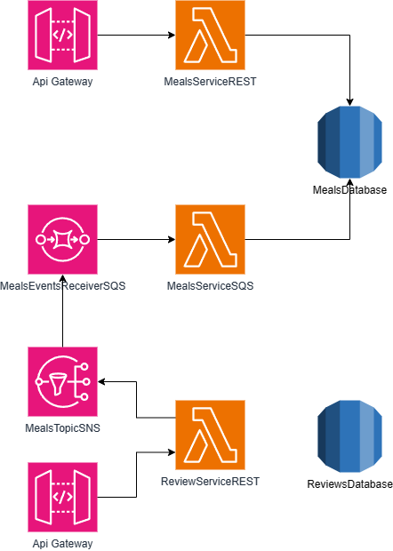

# Cookunity-Challenge

This repository contains the references and information of the two microservices developed for this challenge.

- Meals Service: manages meals, chefs that can create them and customers that can view them
- Reviews Service: manages reviews and allows customers to make them

## Demo

There are instances available to try the service. These instances are hosted by Amazon with the resources specified in the serverless.yml files of each repository.

### Meals Service

- Swagger documentation: https://309bbef9eb.execute-api.us-west-2.amazonaws.com/api
- Service endpoint: https://309bbef9eb.execute-api.us-west-2.amazonaws.com
- Repository: https://github.com/nosedam/Cookunity-Challenge-Meals-Service

### Reviews Service

- Swagger documentation: https://ig4dktrkej.execute-api.us-west-2.amazonaws.com/api
- Service endpoint: https://ig4dktrkej.execute-api.us-west-2.amazonaws.com
- Repository: https://github.com/nosedam/Cookunity-Challenge-Reviews-Service

## General Architecture

The following diagram describes the general architecture for the two services

The services are deployed serverlessly with AWS Lambda and the database is an RDS instance.
The reviews service generates events that are consumed by the meals service sqs subscribed queue.

## Example flows

- Create a meal as a chef

- Create a review and update meal average rating

